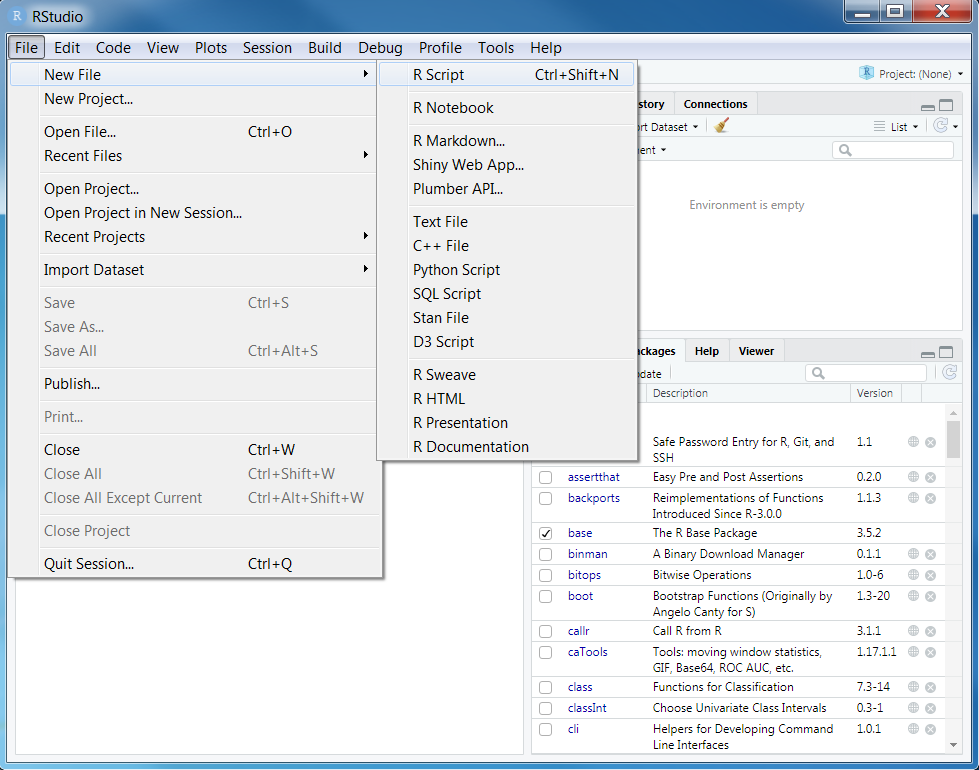
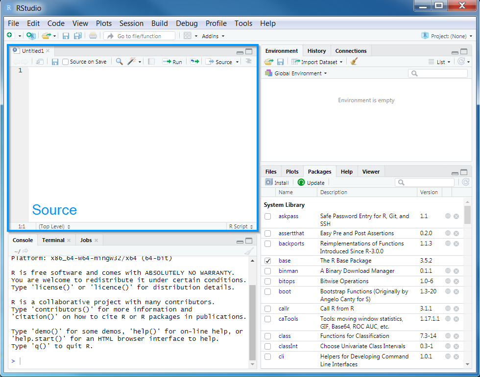
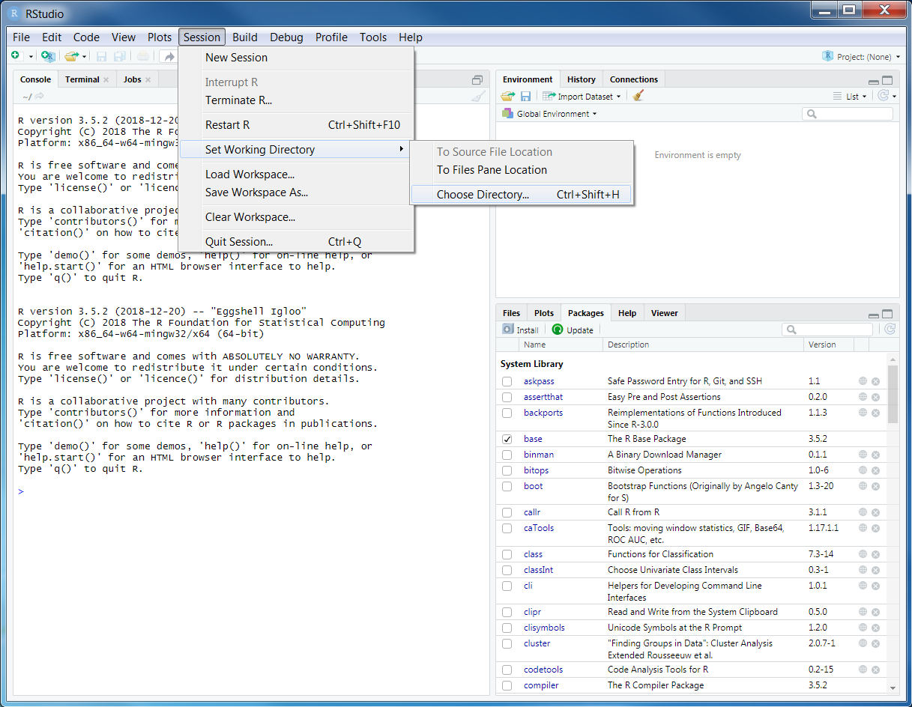
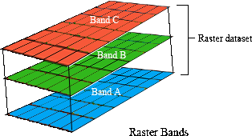

# Data {#data}

## Starting out


We will start by opening RStudio. Ideally, you will have already installed both R and Rstudio before the workshop. If you have not done this already, then please see the [Setting up your computer] section. **During this workshop, please do not copy and paste code from the workshop manual into RStudio. Instead, please write it out yourself in an R script.** When programming, you will spend a lot of time fixing coding mistakes---that is, debugging your code---so it is best to get used to making mistakes now when you have people here to help you. You can create a new R script by clicking on _File_ in the RStudio menu bar, then _New File_, and then _R Script_.

```{r, out.width = "65%", echo = FALSE}

```

\clearpage

After creating a new script, you will notice that a new _Source_ panel has appeared. In the _Source_ panel, you can type and edit code before you run it. You can run code in the _Source_ panel by placing the cursor (i.e., the blinking line) on the desired line of code and pressing `Control + Enter` on your keyboard (or `CMD + Enter` if you are using an Apple computer). You can save the code in the _Source_ panel by pressing `Control + s` on your keyboard (or `CMD + s` if you are using an Apple computer).

```{r, out.width = "65%", echo = FALSE}

```

You can also make notes and write your answers to the workshop questions inside the R script. When writing notes and answers, add a `#` symbol so that the text following the `#` symbol is treated as a comment and not code. This means that you don't have to worry about highlighting specific parts of the script to avoid errors.

```{r}
# this is a comment and R will ignore this text if you run it
# R will run the code below because it does not start with a # symbol
print("this is not a comment")

# you can also add comments to the same line of R code too
print("this is also not a comment") # but this is a comment
```

**Remember to save your script regularly to ensure that you don't lose anything in the event that RStudio crashes (e.g., using `Control + s` or `CMD + s`)!**

## Setting up the R session

Now we will set up our R session for the workshop. Specifically, enter the following R code to attach the R packages used in this workshop.

```{r "load-packages", message = FALSE}
# load packages
library(prioritizr) # package for conservation planning
library(tidyverse)  # package for data wrangling
library(terra)      # package for working with raster data
library(sf)         # package for working with vector data
library(highs)      # package provides HiGHS solver
library(mapview)    # package for creating interactive maps
library(units)      # package for unit conversions
library(scales)     # package for rescaling numbers

# setup printing for tables
## show all rows in tables
options(pillar.print_max = Inf)
```

You should have already downloaded the data for the prioritizr workshop. If you have not already done so, you can download it from here: https://github.com/prioritizr/workshop/raw/master/data.zip. After downloading the data, you can unzip the data into a new folder. Next, you will need to set the working directory to this new folder. To achieve this, click on the _Session_ button on the RStudio menu bar, then click _Set Working Directory_, and then _Choose Directory_.

```{r, out.width = "65%", echo = FALSE}

```

\clearpage

Now navigate to the folder where you unzipped the data and select _Open_. You can verify that you have correctly set the working directory using the following R code. You should see the output `TRUE` in the _Console_ panel.

```{r "set-wd", include = FALSE}
if (!file.exists("data/pu.gpkg")) unzip("data.zip")
setwd("data")
```

```{r "check-wd"}
file.exists("data/pu.gpkg")
```

```{r "reset-wd", include = FALSE}
setwd("..")
```

## Data import

Now that we have downloaded the dataset, we will need to import it into our R session. Specifically, this data was obtained from the "Introduction to Marxan" course and the Australian Government's National Vegetation Information System. It contains vector-based planning unit data (`pu.gpkg`) and the raster-based data describing the spatial distributions of `r nlyr(rast("data/vegetation.tif"))` vegetation classes (`vegetation.tif`) in Tasmania, Australia. Please note this dataset is only provided for teaching purposes and should not be used for any real-world conservation planning. We can import the data into our R session using the following code.

```{r "data-import"}
# import planning unit data
## note that read_sf is from the sf package
pu_data <- read_sf("data/pu.gpkg")

# import vegetation data
## note that rast() is from the terra package
veg_data <- rast("data/vegetation.tif")
```

```{r data-validation, include = FALSE}
# ensure locked in and locked out data are valid
assertthat::assert_that(
  sum(pu_data$locked_in) > 0,
  sum(pu_data$locked_out) > 0,
  sum(pu_data$locked_in & pu_data$locked_out) == 0
)
```

## Planning unit data

The planning unit data contains spatial data describing the geometry for each planning unit and attribute data with information about each planning unit (e.g., cost values). Let's investigate the `pu_data` object. The planning unit data contains `r ncol(pu_data)` columns with the following information:

* `id`: unique identifiers for each planning unit
* `cost`: acquisition cost values for each planning unit (millions of Australian dollars).
* `locked_in`: logical values (i.e., `TRUE`/`FALSE`) indicating if planning units are covered by protected areas or not.
* `locked_out`: logical values (i.e., `TRUE`/`FALSE`) indicating if planning units cannot be managed as a protected area because they contain are too degraded.
* `geom`: spatial geometries for the planning units.

```{r "pu-data", out.width = "90%"}
# print the first six rows of the planning unit data
head(pu_data)

# plot maps of the planning unit data, showing each of the columns
plot(pu_data)
```

\clearpage

```{r "pu-data-2", out.width = "65%"}
# print number of planning units (geometries) in the data
nrow(pu_data)

# print the highest cost value
max(pu_data$cost)

# print the smallest cost value
min(pu_data$cost)

# print average cost value
mean(pu_data$cost)

# plot a map of the planning unit cost data
plot(pu_data[, "cost"])
```

```{r "mapview-pu-data", eval = knitr::is_html_output(), out.width = "65%"}
# plot an interactive map of the planning unit cost data
mapview(pu_data, zcol = "cost")
```

Now, you can try and answer some questions about the planning unit data.

```{block2, type="rmdquestion"}
1. How many planning units are in the planning unit data?
2. What is the highest cost value?
3. How many planning units are covered by the protected areas (hint: `sum(x)`)?
4. What is the proportion of the planning units that are covered by the protected areas (hint: `mean(x)`)?
5. How many planning units are highly degraded (hint: `sum(x)`)?
6. What is the proportion of planning units are highly degraded (hint: `mean(x)`)?
7. Can you verify that all values in the `locked_in` and `locked_out` columns are zero or one (hint: `min(x)` and `max(x)`)?.
8. Can you verify that none of the planning units are missing cost values (hint: `all(is.finite(x))`)?.
9. Can you very that none of the planning units have duplicated identifiers? (hint: `sum(duplicated(x))`)?
10. Is there a spatial pattern in the planning unit cost values (hint: use `plot(x)` to make a map).
11. Is there a spatial pattern in where most planning units are covered by protected areas (hint: use `plot(x)` to make a map).

```

## Vegetation data

The vegetation data describes the spatial distribution of `r nlyr(veg_data)` vegetation classes in the study area. This data is in a raster format and so the data are organized using a square grid comprising square grid cells that are each the same size. In our case, the raster data contains multiple layers (also called "bands") and each layer has corresponds to a spatial grid with exactly the same area and has exactly the same dimensionality (i.e., number of rows, columns, and cells). In this dataset, there are `r nlyr(veg_data)` different regular spatial grids layered on top of each other -- with each layer corresponding to a different vegetation class -- and each of these layers contains a grid with `r prettyNum(nrow(veg_data))` rows, `r prettyNum(ncol(veg_data))` columns, and `r prettyNum(ncell(veg_data))` cells. Within each layer, each cell corresponds to a `r xres(veg_data) / 1000` by `r yres(veg_data) / 1000` km square. The values associated with each grid cell indicate the (one) presence or (zero) absence of a given vegetation class in the cell.

```{r, out.width = ifelse(knitr::is_html_output(), "65%", "55%"), echo = FALSE}

```

Let's explore the vegetation data.

```{r "veg_data-1", out.width = "65%"}
# print a short summary of the data
print(veg_data)

# print number of layers in the data
nlyr(veg_data)

# print the name of each layer
names(veg_data)

# layers can be accessed using indices or names,
## for example the 30th class is "Sedgelands, rushs or reeds"
## and we can make a map of it using the index or the name

# plot a map of the 30th class using the index
plot(veg_data[[30]])

# plot a map of the 30th class using its layer name
plot(veg_data[["Sedgelands, rushs or reeds"]])
```

```{r "mapview-veg-data", eval = knitr::is_html_output(), out.width = "70%"}
# plot an interactive map of the 30th class
## note that we use method = "ngb" because the data are not continuous
mapview(raster::raster(veg_data[[30]]), method = "ngb")
```

```{r "veg-data-2"}
# print resolution on the x-axis
xres(veg_data)

# print resolution on the y-axis
yres(veg_data)

# print spatial extent of the grid, i.e., coordinates for corners
ext(veg_data)

# print a summary of the first layer
print(veg_data[[1]])

# calculate the sum of all the cell values in the first layer
global(veg_data[[1]], "sum", na.rm = TRUE)

# calculate the maximum value of all the cell values in the first layer
global(veg_data[[1]], "max", na.rm = TRUE)

# calculate the minimum value of all the cell values in the first layer
global(veg_data[[1]], "min", na.rm = TRUE)

# calculate the mean value of all the cell values in the first layer
global(veg_data[[1]], "mean", na.rm = TRUE)
```

```{r "stats-veg-data"}
# calculate the maximum value in each layer
as_tibble(global(veg_data, "max", na.rm = TRUE), rownames = "feature")
```

Now, you can try and answer some questions about the vegetation data.

```{block2, type="rmdquestion"}
1. What part of the study area is the "Temperate tussock grasslands" vegetation class found in (hint: make a map)?
2. What proportion of cells contain the "Heathland" vegetation class (hint: calculate the mean value of the cells)?
3. Which vegetation class is present in the greatest number of cells?
4. The planning unit data and the vegetation data should have the same coordinate reference system. Can you check if they are the same?

```
